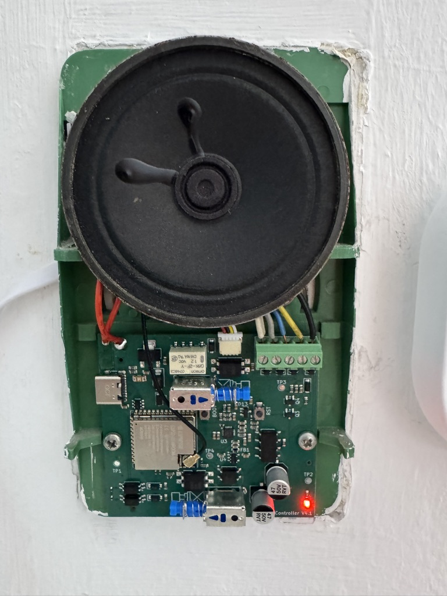

# Doorbell controller (Klingel V4)

A drop-in smart replacement for a **WF26 handset** on an **STR Elektronik TV20/S**
apartment-intercom bus, built on an ESP32-S3 running ESPHome. To the building it looks like the
handset it replaces; to Home Assistant it looks like a doorbell, an intercom and a door opener.



## What it does

- **Ring detection** — the front-door bell (Türruf) and the floor button (Etagenruf) are separate
  HA binary sensors and events: phone notifications, presence-aware automations, "someone rang
  while you were out" history.
- **Gong suppression** — a solid-state switch in the chime path mutes the mechanical gong under
  firmware policy (occupancy, quiet hours, do-not-disturb) without touching ring detection or the
  intercom session. The switch is normally-closed: if the smart layer dies, the doorbell rings
  like a stock handset.
- **Door opener from HA** — with the safety in hardware, not firmware: the door relay pair
  replicates the WF26's break-before-make sequence with an RC delay, and an independent hardware
  watchdog releases the door bridge after ~6.7 s no matter what the firmware does. A crashed ESP
  or a runaway automation cannot hold the door open.
- **Two-way audio** — an ES8311 codec taps the bus speech pair through a protected divider (RX)
  and drives the talk line through the same 2.2 kΩ handshake the central expects from a real
  handset (TX). Push-to-talk from HA; wired for HA's Assist voice pipeline.
- **Fully passive fallback** — the original WF26 relay/switch/speaker core is carried on the
  board, hardwired. Gong, listen, talk and door-open all work with the electronics unpowered;
  the smart layer only ever adds, never gates.
- **Local everything** — ESPHome native HA API, OTA updates, on-device web UI. No cloud.

## How the TV20/S bus works

Five wires run from the central to each flat:

| Line | Role |
|------|------|
| 1 | Common — the reference for everything below |
| 2 | Standing **+12 V supply**, current-limited (~90 Ω source), always on |
| 3 | Speech — talk audio toward the door station |
| 4 | **Türruf** — front-door ring |
| 5 | **Etagenruf** — floor-button ring |

A **ring** is the central putting ~12 V on a ring line for about a second; the gong is literally
the handset's speaker driven from that pulse through a capacitor (the floor line rings the
speaker directly). The line-4 pulse also pulls in a relay inside the handset, which **seals
itself in from line 2** and holds line 4 high — that standing level *is* the "call in progress"
state, and the supply rail sags visibly under its load. **Talk** is a 2.2 kΩ bridge from the
speech line to the supply: the central detects exactly that resistance as "off-hook" and routes
audio, which simply rides on top of the DC. The **door opener** is a plain line 2↔3 contact
closure, sequenced break-before-make so the latch drops first. The central ends every session by
sinking line 2 low after a timeout, which drops all latches. A stock handset contains no
electronics at all — a relay, capacitors, switches and a speaker.

The board senses the ring lines with optocouplers, switches its functions with PhotoMOS relays
in the same places the WF26's mechanical switches sat, and leaves the bus model untouched — the
central cannot tell the difference. The full reverse-engineering lives in `DESIGN.md`, the WF26
handset schematic in `wf26/`, and real-bus scope captures in `captures/` — all usable on their
own if you have this intercom family and only want ring detection or muting.

## Beyond the assembled board

The JLCPCB-assembled PCB needs four things it doesn't ship with:

- **Antenna** — the ESP32-S3-WROOM-**1U** has no PCB antenna; any 2.4 GHz u.FL/IPEX antenna
  works (a flex-PCB patch routes nicely out of the enclosure).
- **Speaker/mic transducer (LS1)** — a 16 Ω transducer soldered to the LS1 wire pads. It is the
  gong, the passive listen earpiece and the passive talk mic in one; deliberately not
  board-assembled.
- **JST SH-4 pigtail for J3** (the deployed power inlet) — a pre-crimped SH-4 lead is strongly
  recommended; hand-crimping 1 mm SH contacts is misery.
- **USB power cable** — a male-USB-A cable spliced onto the pigtail (a USB-A→C cable with the C
  end sacrificed works well). The supply side must be a USB-A port or wall-wart: a bare USB-C
  lead stays dead without CC pull-downs. Wiring and polarity checks:
  `docs/design/usb-jst-j3-wiring.svg`.

> ⚠️ **Never power J1 (the on-board USB-C) and J3 at the same time.** They drive the same raw
> VBUS net with no OR-ing diode — unplug the wall feed before bench-flashing over USB-C. For an
> in-place reflash, move the J3 cable's far end from the wall-wart to a laptop instead.

**Status:** the V4.1 board (JLCPCB-fabbed and -assembled) is bench-verified and deployed —
installed in the wall in place of the WF26, running `firmware/doorbell-v4.yaml`. The smart layer
is powered by a USB wall-wart into the J3 connector; the TV20/S bus powers only the passive
handset core, so the electronics draw nothing from the shared intercom supply.

## Repository layout

The **KiCad files** (`kicad/doorbell.kicad_sch` / `.kicad_pcb`) are the authoritative source for
the board — edited directly in KiCad. `./build.sh all-route` only verifies them and exports the
fab outputs; it does not author or regenerate the board.

| Path | What |
|------|------|
| `REQUIREMENTS.md` | *What* the board must do — functional + safety requirements (start here for intent). |
| `DESIGN.md` | *How* it's built — architecture, GPIO map, relays/SSRs, audio path, bus model. |
| `VERIFICATION.md` | Design-verification gates plus the bench bring-up / commissioning record. |
| `ORDERING.md` | JLCPCB ordering notes (Standard PCBA workflow + the review gates). |
| `kicad/` | Authoritative KiCad project (`doorbell.kicad_sch` / `.kicad_pcb`). See `kicad/README.md`. |
| `tools/` | Build/inspection Python scripts (placement check, routing verify, STEP/BOM/CPL export). |
| `firmware/` | ESPHome configs — `doorbell-v4.yaml` (deployed), `doorbell-v4-bench.yaml` (bench twin: debug SSR switches, audio loopback instrumentation, no HA events), `doorbell-v4-tonegen.yaml` (spare board as bench tone source / HA media player). |
| `sim/` | Node circuit simulator + PCB viewer used to sanity-check the design (`cd sim`; `npm test`). |
| `wf26/` | Reverse-engineered WF26 handset (`wf26.kicad_sch`). |
| `captures/` | Bench scope captures of the real TV20/S (ring, door-open, timeout) + web viewer. |
| `docs/` | Datasheets and reference docs (`datasheets/`, `design/`, `ordering/`) — incl. the wall wire-up map (`design/wall-wiring-v4.svg`) and the J3 power-cable pinout (`design/usb-jst-j3-wiring.svg`). |
| `fab/` | Generated fab outputs (Gerbers, drill, BOM, CPL, STEP) — produced by `./build.sh fab`. |
| `orders/` | Shipped fabrication order archives. |

## Build

```bash
./build.sh all-route   # verify (ERC/DRC/placement/routing) + export fab outputs
```

See `kicad/README.md` for the build pipeline details.

## Firmware

```bash
cd firmware
esphome run doorbell-v4.yaml    # needs firmware/secrets.yaml (see below)
```

Secrets (WiFi credentials, API encryption key, OTA password) live in `firmware/secrets.yaml`,
which is gitignored — create it with `wifi_ssid`, `wifi_password`, `api_encryption_key` and
`ota_password` before building. Run `esphome clean` after switching configs or renaming a device
— a stale build directory fails the build in confusing ways.
